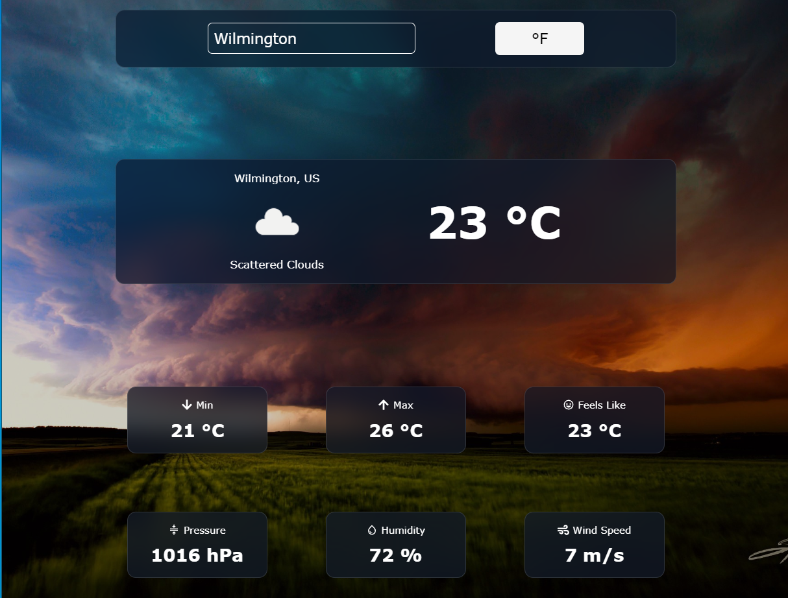
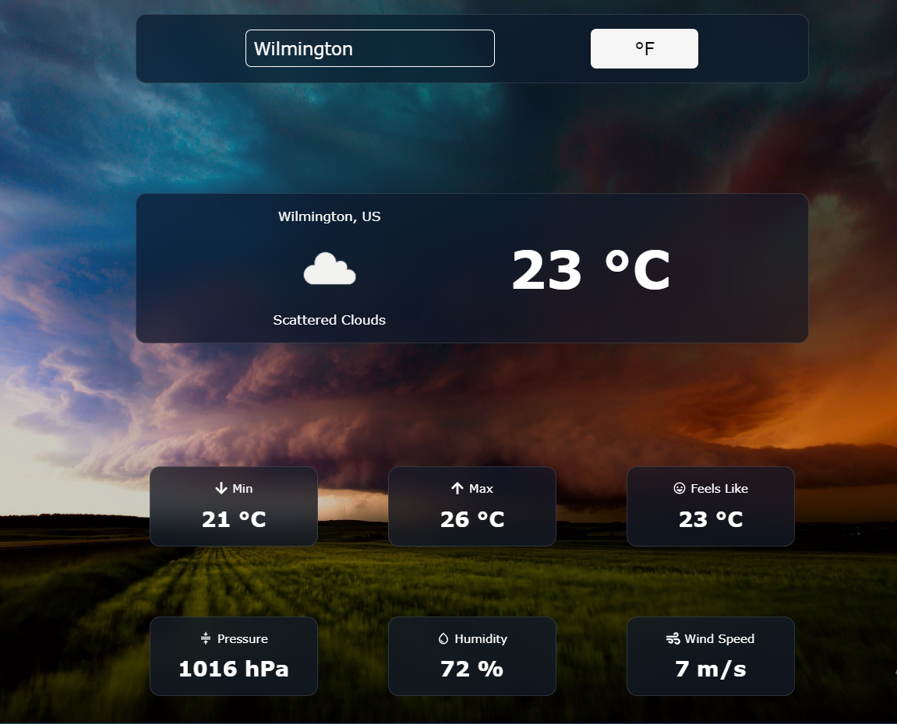
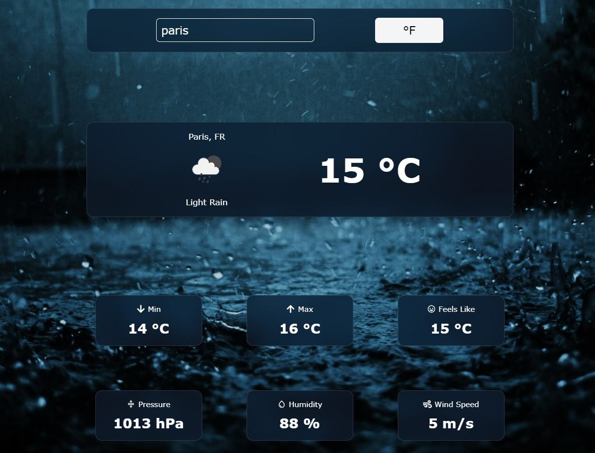
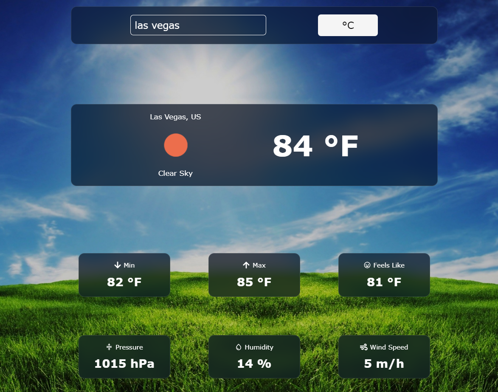

A simple weather app built using React and OpenWeatherApp 
free API. The app allows the user to type in a city name and see the current 
weather forecast for that city. The weather forecast includes temp, feels 
like, min and max temp, pressure, humidity, wind speed. This app also 
features changing backgrounds that correspond to the current weather
event (sunny, cloudy, rain, snowing, fog).

